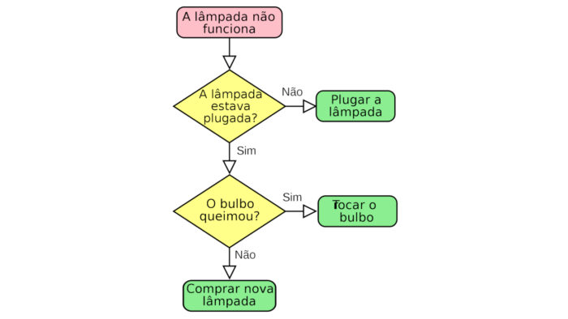

# algoritmos
## Estudo de algoritmos em varias linguagens e Portugol e VisualG.
<h1 align="left">
    
</h1>
<h2>
Neste repositório, abordaremos estudos e resoluções de exercícios do livro "Algoritmos e Programação de computadores", da Editora Campus.
 Autores:
- Dilermando Piva Junior;
- Gilbertto Shigueo Nakamiti;
- Angela de Medonça Engelbrecht;
- Francisco Bianchi.
</h2>
